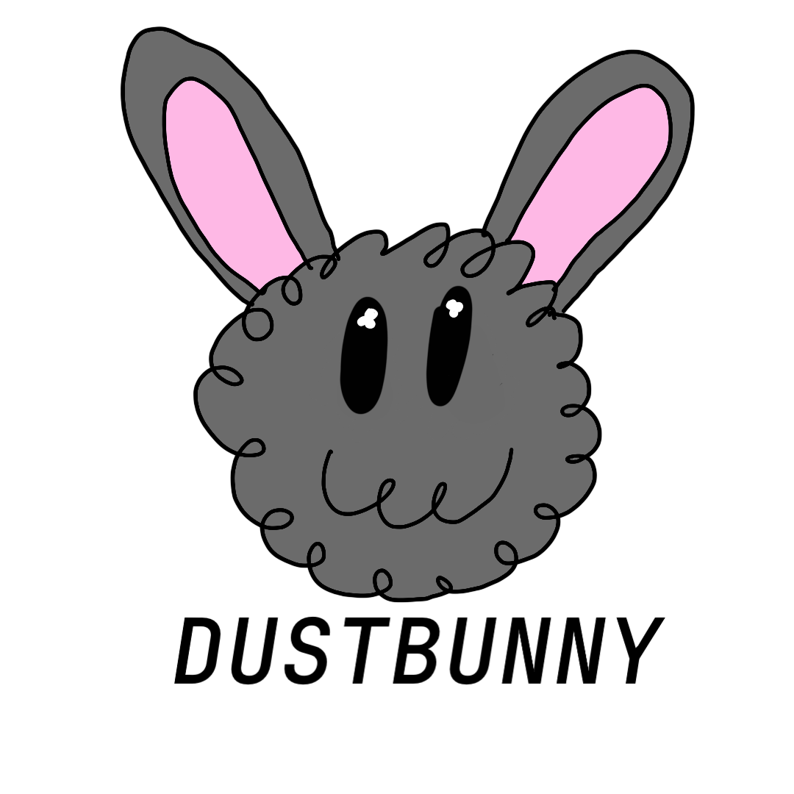

# Dustbunny


Dustbunny is a hobby shell designed for Unix systems. It serves as an exercise for me learning the C Programming Language, and disciplining me as a programmer in general.

Dustbunny is not intended to be 100% POSIX compliant.

### Installation
You can run these commands to install dustbunny:
```sh
git clone -b vX.X.X https://github.com/dot-underscore1703/dustbunny # note: replace X.X.X with the version you wish to install, e.g '-b v0.4.0'
cd dustbunny
cmake -S . -B build
cmake --install build
```

### Interested in Contributing?
Check out docs/CONTRIBUTING.md in this repo.
